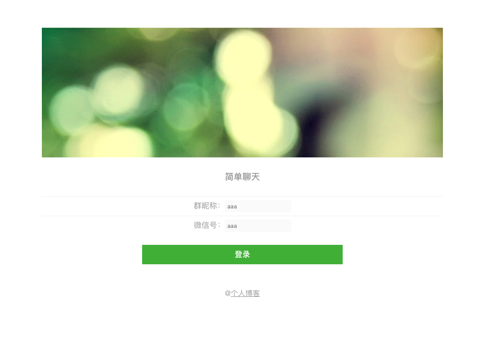
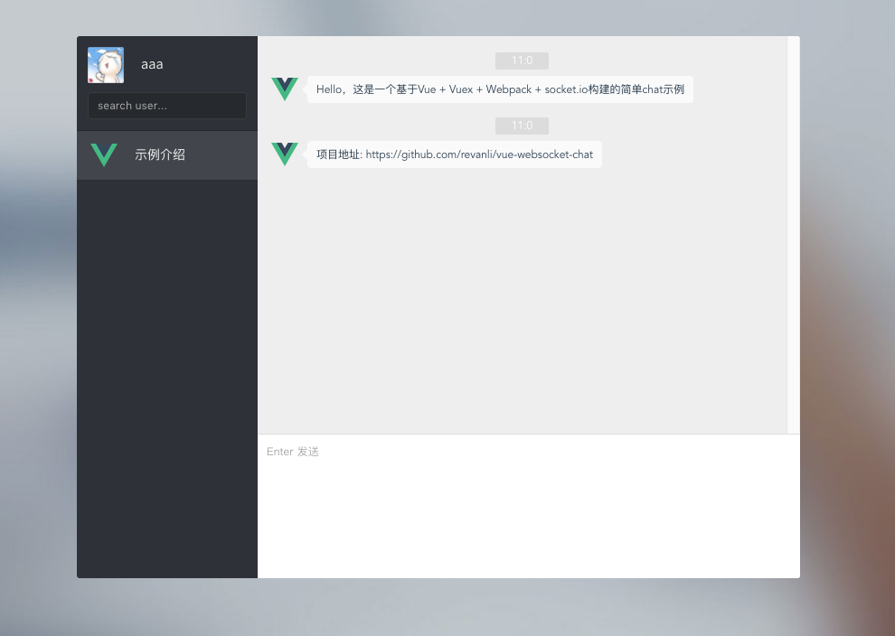
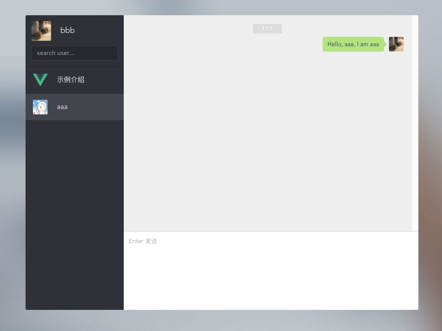
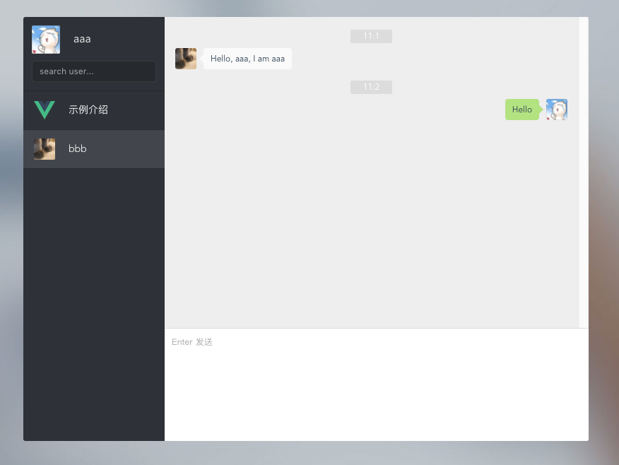
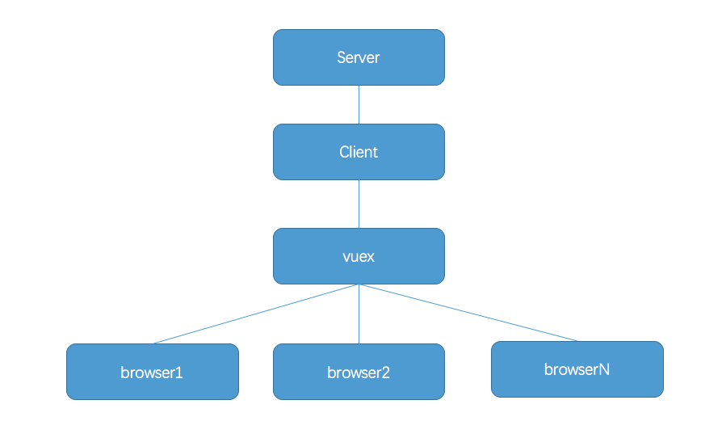

# vue-websocket-chat

> Vue + Vuex + socket.io to build simple web chat project

## Build Setup

``` bash
# install dependencies
npm install

# serve with hot reload at localhost:8080
npm run dev

# build for production with minification
npm run build
```

## 运行效果
- 登陆界面  



- 登陆成功  



- 发送消息



- 接受消息并回复



## 总结


流程：server和client建立websocket通信，监听用户登陆和发送事件，在server保存用户信息，然后同步到client端，然后用vuex保存，其他组件通过vuex来拿到数据，最后通过vuex来发送消息，然后同步到server端
